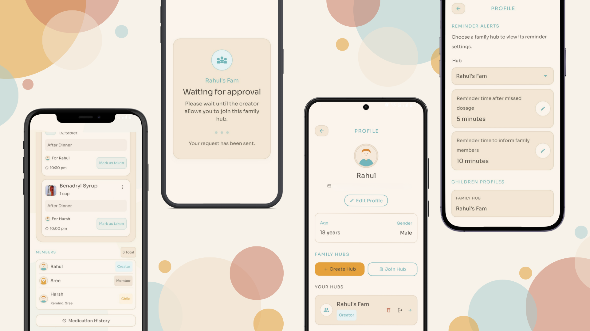

# MedTrack

**A family medication companion that helps everyone stay on track with their medication.** 
**A shared space to manage medications, reminders, family members, and medication history in one place.**

## About MedTrack

Imagine someone relies on a medication reminder app for an important medicine. The reminder goes off, but they forget to take it and never mark it as taken. A reminder app may simply assume they missed a dose. But what if that medicine is crucial? What if they need help and nobody knows?

**That's why MedTrack involves family.** It keeps medication shared, tracks whether doses are taken, and can alert the right family members when a dose remains unmarked, helping someone notice when a loved one may need attention.

## 
Main Features

  

## Additional Features

- **Authentication**
  - Email/password signup and login
  - Email verification and password reset

- **Profile Management**
  - Edit personal details, avatar, age, gender, and About Me

- **Hub Management**
  - Multiple family hubs
  - Hub Codes and approval-based joining
  - Member removal, leaving, Creator transfer, and hub deletion

- **Medication Reminders**
  - 24-hour, 48-hour, and custom cycles
  - Missed-dose and family escalation reminders

- **Permissions**
  - Role-based access for medication and hub management

- **Real-Time Sync**
  - Membership, medication, and status changes sync across devices

- **Android Notifications**
  - System-level medication reminders with action support

## Learn More

For a complete breakdown of MedTrack's functionality: **[View All Features](ALL_FEATURES.md)**

<h2 align="center">The App at a Glance</h2>

  <em>Take a quick look at the current MedTrack MVP.</em>

  

<h2 align="center">Tech Stack</h2>

<table align="center">
  <tr>
    <th>Category</th>
    <th>Technologies</th>
  </tr>
  <tr>
    <td><strong>Language</strong></td>
    <td>Kotlin</td>
  </tr>
  <tr>
    <td><strong>Frontend / UI</strong></td>
    <td>Jetpack Compose, Material Design 3 (M3)</td>
  </tr>
  <tr>
    <td><strong>Backend & Cloud</strong></td>
    <td>Firebase (Firestore, Authentication, Storage, App Check)</td>
  </tr>
  <tr>
    <td><strong>Local Database</strong></td>
    <td>Room (SQLite)</td>
  </tr>
  <tr>
    <td><strong>Networking & API</strong></td>
    <td>Retrofit, OkHttp, Moshi</td>
  </tr>
  <tr>
    <td><strong>AI & Voice</strong></td>
    <td>Google Gemini API, Android Speech-to-Text</td>
  </tr>
  <tr>
    <td><strong>Development</strong></td>
    <td>Google AI Studio</td>
  </tr>
</table>

<h3 align="center">🚀 Where It Started</h3>

  MedTrack started as my first prototype for my first hackathon.
   
  You can explore the original prototype here:

  <a href="https://med-track-website-dt4r.vercel.app/">
    <strong>View the First Prototype →</strong>
  </a>

<h2 align="center">Support & Feedback</h2>

  Found a bug, have a suggestion, or something isn't working as expected?
   
  Feel free to reach out by email.

  📧 <strong>Email:</strong> rahulchandragiri3@gmail.com

 
