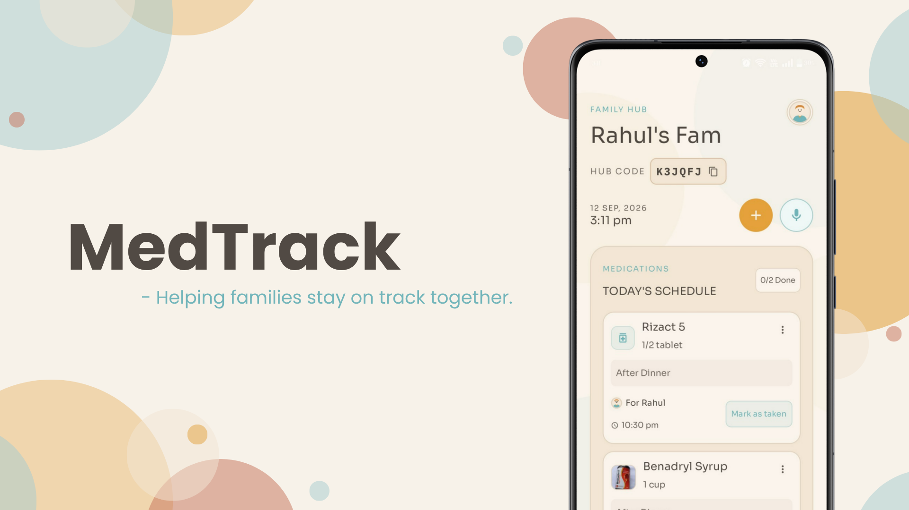
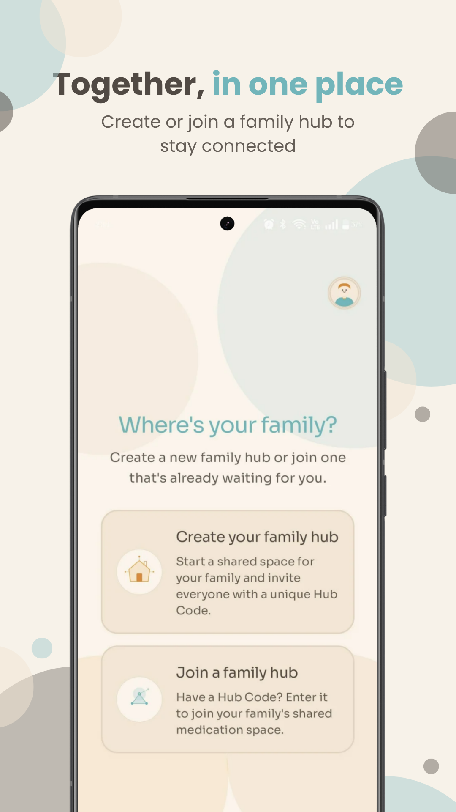
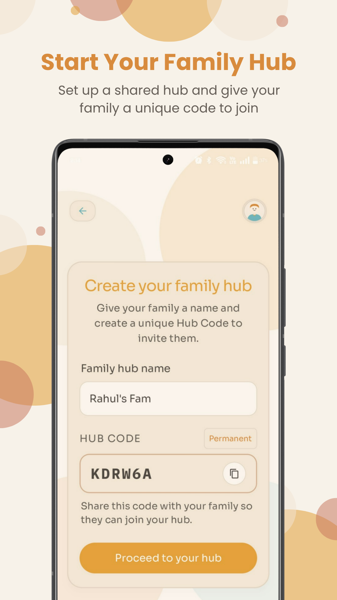
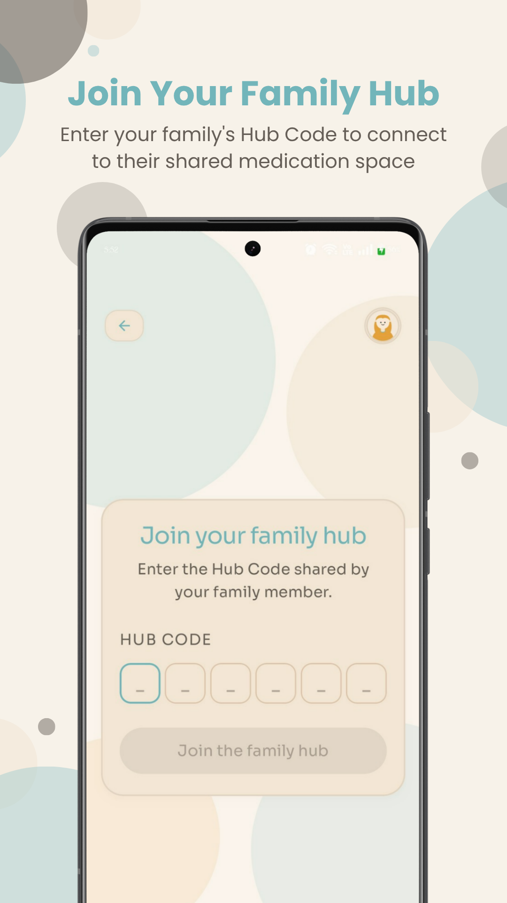
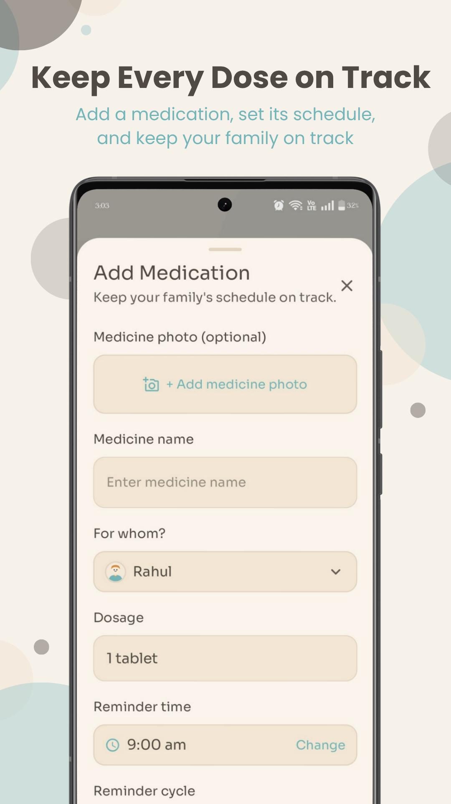
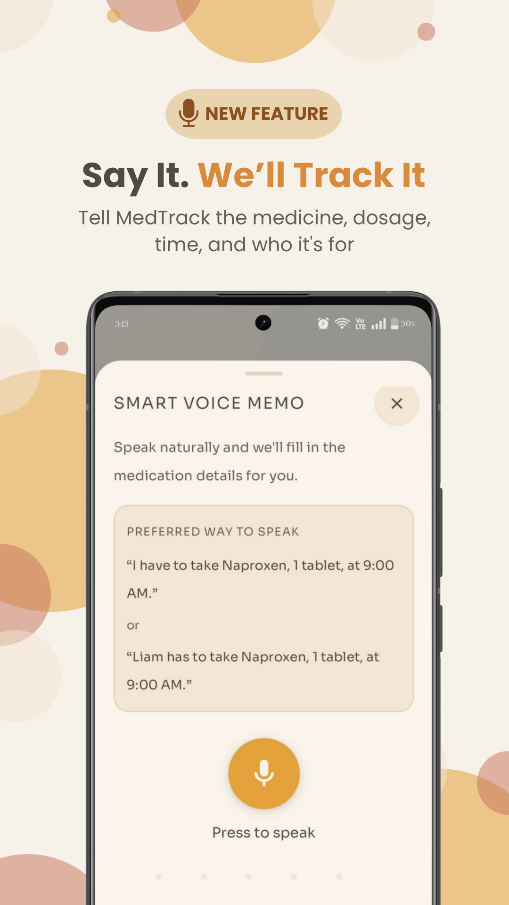
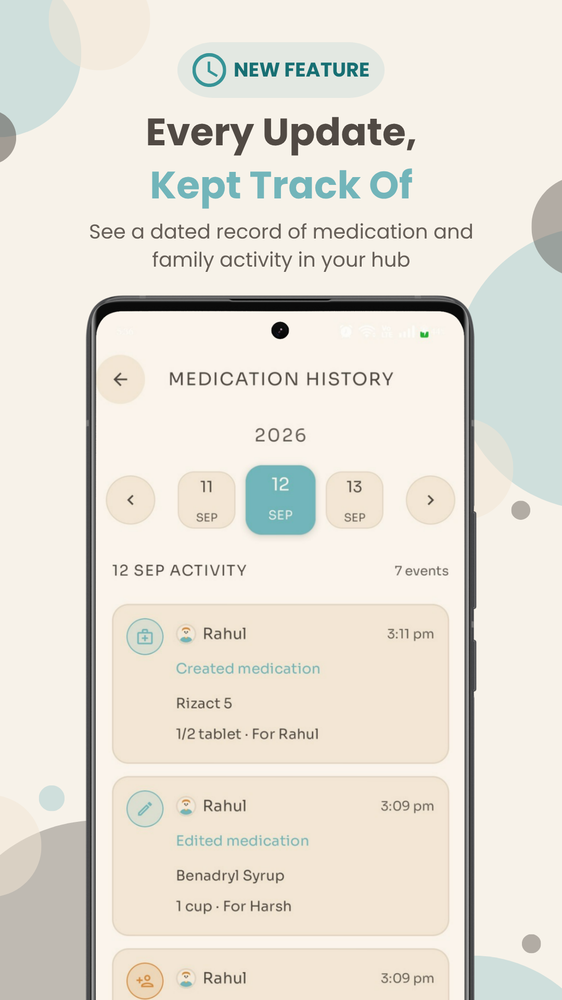
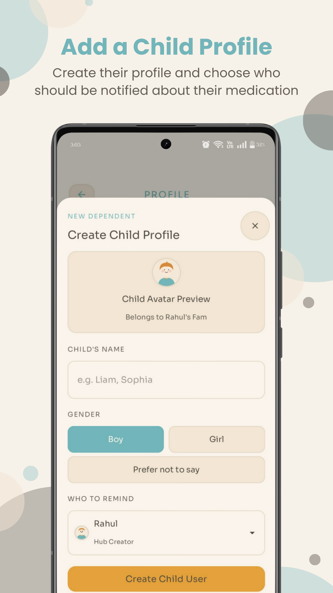

# MedTrack

**A family medication companion that helps everyone stay on track with their medication.** 
**A shared space to manage medications, reminders, family members, and medication history in one place.**

## About MedTrack

Imagine someone relies on a medication reminder app for an important medicine. The reminder goes off, but they forget to take it and never mark it as taken. A reminder app may simply assume they missed a dose. But what if that medicine is crucial? What if they need help and nobody knows?

**That's why MedTrack involves family.** It keeps medication shared, tracks whether doses are taken, and can alert the right family members when a dose remains unmarked, helping someone notice when a loved one may need attention.

## 
Main Features

  

## Additional Features

- **Authentication**
  - Email/password signup and login
  - Email verification and password reset

- **Profile Management**
  - Edit personal details, avatar, age, gender, and About Me

- **Hub Management**
  - Multiple family hubs
  - Hub Codes and approval-based joining
  - Member removal, leaving, Creator transfer, and hub deletion

- **Medication Reminders**
  - 24-hour, 48-hour, and custom cycles
  - Missed-dose and family escalation reminders

- **Permissions**
  - Role-based access for medication and hub management

- **Real-Time Sync**
  - Membership, medication, and status changes sync across devices

- **Android Notifications**
  - System-level medication reminders with action support

## Learn More

For a complete breakdown of MedTrack's functionality:

👉 **[View All Features](ALL_FEATURES.md)**
